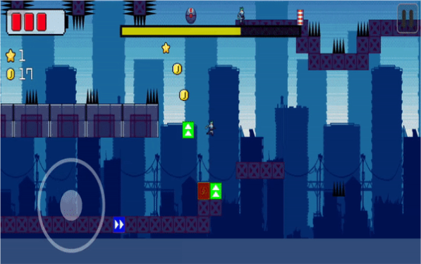

# Nuclear-Zero: SF 아포칼립스 2D 플랫포머 러닝 게임

## 프로젝트 개요

Nuclear-Zero는 SF 아포칼립스 세계관을 배경으로 한 2D 도트 그래픽 플랫포머 러닝 게임입니다.
플레이어는 다양한 지형과 장애물을 활용하여 적을 피하고, 스테이지를 클리어하며,
곳곳에 숨겨진 알파벳을 모아 스토리의 비밀을 풀어나갑니다.
스테이지 진행 중 거대한 몬스터가 플레이어를 쫓아오며, 몬스터에 닿으면 즉시 게임이 종료되는 방식으로
긴장감을 높였습니다.

[게임 소개 영상](https://www.youtube.com/watch?v=OmvdJE0bo2k)

---

## 프로젝트 요약

**프로젝트 기간**: 2022년 7월 - 2022년 9월  
**플랫폼**: Google Play Store  
**엔진**: Unity  
**도구**: Git, C#, Google API, Trello

<!-- ### GitHub 링크

[GitHub - Nuclear-Zero](https://github.com/SeoBYP/Nuclear_Zero) -->

---

## 구현 상세

### 1. 플랫폼 기반 플레이 시스템 구현

- **스테이지 공략 시스템**: 플레이어가 다양한 지형과 장애물을 활용하여 스테이지를 공략할 수 있도록 설계했습니다. 각 스테이지의 난이도는 장애물 패턴과 적의 배치로 구성되며, 반복적인 플레이에도 도전적인 경험을 제공합니다.
- **다양한 블록 효과 구현**:
  - **체력 회복 블록**: 블록에 닿으면 일정량의 체력이 회복되어 플레이어의 생존 가능성을 높입니다.
  - **가시 블록**: 블록에 닿으면 일정량의 체력이 감소하여 스테이지 진행에 장애 요소가 됩니다.
  - **가속 블록**: 블록에 닿으면 일정 시간 동안 플레이어가 가속되어 빠르게 이동할 수 있습니다.
  - **감속 블록**: 블록에 닿으면 일정 시간 동안 이동 속도가 느려져 신중한 움직임이 필요하게 됩니다.
  - **사라지는 블록**: 플레이어가 밟으면 일정 시간 후 점차 사라지기 시작하는 블록으로, 빠르게 스테이지를 공략해야 하는 요소로 작용합니다.
  - **움직이는 블록**: 상하 또는 좌우로 움직이는 블록을 추가하여 플레이어가 타이밍을 맞춰 이동해야 하는 퍼즐 요소를 제공했습니다.
  - **점프 블록**: 플레이어가 밟으면 일반 점프보다 더 높은 점프를 할 수 있어 특정 지형에 도달할 수 있도록 구현했습니다.
- **몬스터 추격 시스템**: 스테이지 진행 중에 거대한 몬스터가 플레이어를 쫓아오며, 플레이어가 몬스터에 닿으면 즉시 게임이 종료됩니다. 이를 통해 플레이어에게 긴장감을 주며 빠른 판단과 신속한 움직임을 요구합니다.

### 2. 미니게임 및 멀티 엔딩 시스템

- **숨겨진 알파벳 수집 미니게임**: 각 스테이지에는 스토리의 비밀을 밝히는 열쇠가 되는 숨겨진 알파벳이 배치되어 있습니다. 플레이어는 스테이지를 탐험하며 알파벳을 모아 스토리의 숨겨진 비밀을 풀어가는 재미를 느낄 수 있습니다.
- **별 획득에 따른 멀티 엔딩**: 각 스테이지마다 플레이어가 획득한 별의 개수에 따라 엔딩이 달라지도록 구현했습니다. 모든 스테이지에서 높은 점수로 별을 최대한 많이 모을수록 숨겨진 결말이 제공되며, 플레이어의 성취감을 높이고 반복 플레이의 동기를 제공합니다.
- **저장 시스템 설계**: 플레이어의 진행 상황과 수집된 알파벳, 별 획득 상태, 스토리 분기 정보를 저장하고, 언제든지 게임을 중단했다가 다시 이어서 할 수 있도록 데이터 관리 시스템을 설계했습니다.

### 3. 게임 수익 모델 구현

- **Unity IAP를 활용한 인앱 결제**: Unity IAP(인앱 결제) 기능을 활용하여 플레이어가 게임 내에서 아이템을 구매할 수 있도록 인앱 결제 시스템을 구축했습니다. 이 기능을 통해 게임 진행에 필요한 아이템이나 추가 콘텐츠를 구매할 수 있어 사용자 경험을 향상하고 수익을 창출할 수 있도록 했습니다.
- **Google Admob을 통한 광고 수입**: Google Admob을 연동하여 배너 광고 및 전면 광고를 게임에 삽입하여 수익 모델을 강화했습니다. 광고는 게임 진행을 방해하지 않도록 설계하여, 플레이어가 자연스럽게 게임을 즐기면서 광고를 노출할 수 있도록 구성했습니다.
